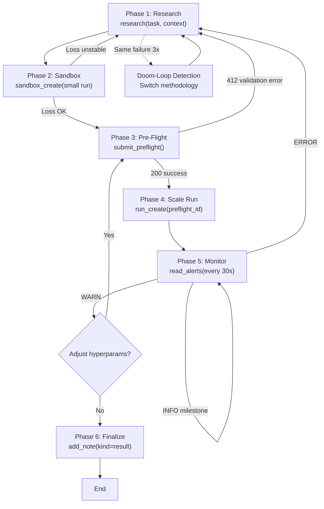

# The Agent Loop: Autonomous Fine-Tuning Orchestration

Stellarator's agent loop is a six-phase autonomous workflow where agents research, validate, and scale fine-tuning experiments. This document defines each phase, the API contract, doom-loop detection, and a complete worked example.

---

## Phase 1: Research

**Goal**: Before proposing any configuration, consult evidence.

**API call:**
```bash
curl -X POST http://localhost:8000/v1/research \
  -H "Authorization: Bearer $AGENT_TOKEN" \
  -H "Content-Type: application/json" \
  -d '{
    "task": "improve instruction-following on MMLU",
    "context": "1B model, 4-hour budget, LoRA preferred",
    "sources": ["arxiv", "huggingface"]
  }'
```

**Response** (structured recipe):
```json
{
  "research_id": "res_abc123",
  "papers": [
    {
      "arxiv_id": "2305.18290",
      "title": "Direct Preference Optimization (DPO)",
      "authors": [".."],
      "year": 2023,
      "relevance_score": 0.95,
      "summary": "DPO removes need for reward model; direct LLM-on-LLM comparison"
    }
  ],
  "recipe": {
    "methodology": "DPO or SFT+supervised tuning",
    "dataset_candidates": [
      {"name": "ultrafeedback", "size": 63k, "quality": "high"},
      {"name": "hh-rlhf", "size": 160k, "quality": "medium"}
    ],
    "hyperparams": {
      "learning_rate": "2e-5 to 5e-5",
      "batch_size": "16-32 per GPU",
      "num_epochs": "1-3"
    },
    "estimated_training_time": "2-4 hours on 1 A10G"
  }
}
```

**Outcome**: Agent receives structured, citable recommendations. Sub-agent runs in parallel; findings flow to orchestrator's context only.

---

## Phase 2: Sandbox

**Goal**: Cheap, fast validation before scale (max CPU or single A10G, max 50 steps).

**API call:**
```bash
curl -X POST http://localhost:8000/v1/sandbox_create \
  -H "Authorization: Bearer $AGENT_TOKEN" \
  -H "Content-Type: application/json" \
  -d '{
    "base_model": "meta-llama/Llama-2-1b",
    "method": "dpo",
    "hyperparams": {"learning_rate": 2e-5, "num_epochs": 1, "max_steps": 50},
    "dataset_mixture": [
      {"source": "huggingface", "dataset": "allenai/ultrafeedback", "split": "train[:100]"}
    ],
    "gpu_type": "A10G",
    "gpu_count": 1,
    "user_goal": "Test DPO recipe on MMLU instruction-following",
    "agent_plan": "Validate DPO on 100-example ultrafeedback subset to check loss curve before scale"
  }'
```

**Response:**
```json
{
  "sandbox_run_id": "sbx_xyz789",
  "status": "running",
  "estimated_duration_minutes": 5,
  "cost_estimate_usd": 0.25
}
```

**Polling** (agent checks every 10s):
```bash
curl -s http://localhost:8000/v1/sandbox/{sandbox_run_id} \
  -H "Authorization: Bearer $AGENT_TOKEN" | jq '.status, .metrics'
```

**Outcome**: Agent reads loss, gradient stats. If training is unstable (NaN, diverging loss), research again. If stable, proceed to Phase 3.

---

## Phase 3: Pre-Flight

**Goal**: Mandatory validation gate before launching a scale run. Server checks schema completeness and sandbox lineage.

**API call:**
```bash
curl -X POST http://localhost:8000/v1/submit_preflight \
  -H "Authorization: Bearer $AGENT_TOKEN" \
  -H "Content-Type: application/json" \
  -d '{
    "sandbox_run_id": "sbx_xyz789",
    "config": {
      "base_model": "meta-llama/Llama-2-1b",
      "method": "dpo",
      "hyperparams": {"learning_rate": 2e-5, "num_epochs": 3, "batch_size": 32},
      "dataset_mixture": [
        {
          "source": "huggingface",
          "dataset": "allenai/ultrafeedback",
          "split": "train",
          "weight": 0.8
        },
        {
          "source": "huggingface",
          "dataset": "GAIR/lima",
          "split": "train",
          "weight": 0.2
        }
      ],
      "gpu_type": "A100",
      "gpu_count": 2
    },
    "user_goal": "Improve MMLU instruction-following from 28% → 35%",
    "agent_plan": "DPO on ultrafeedback (80%) + LIMA (20%), scaling from 100 → 10k examples, lr=2e-5 per DPO paper recommendations",
    "citations": [
      {
        "type": "paper",
        "arxiv_id": "2305.18290",
        "title": "Direct Preference Optimization",
        "authors": ["Rafailov et al."],
        "year": 2023
      }
    ]
  }'
```

**Success response** (HTTP 200):
```json
{
  "preflight_id": "pf_abc999",
  "validated": true,
  "sandbox_lineage": "sbx_xyz789",
  "estimated_cost_usd": 45.80,
  "estimated_duration_hours": 3.2
}
```

**Failure response** (HTTP 412):
```json
{
  "error": "Missing required field",
  "field": "citations",
  "message": "Scale runs (≥2 GPUs) require ≥1 citation. Submit preflight with citations array.",
  "sandbox_run_id": "sbx_xyz789"
}
```

---

## Phase 4: Scale Run

**Goal**: Launch full training with preflight lineage. Server rejects 412 if preflight missing or sandbox stale.

**API call:**
```bash
curl -X POST http://localhost:8000/v1/runs \
  -H "Authorization: Bearer $AGENT_TOKEN" \
  -H "Content-Type: application/json" \
  -d '{
    "preflight_id": "pf_abc999",
    "base_model": "meta-llama/Llama-2-1b",
    "method": "dpo",
    "hyperparams": {"learning_rate": 2e-5, "num_epochs": 3, "batch_size": 32},
    "dataset_mixture": [
      {"source": "huggingface", "dataset": "allenai/ultrafeedback", "split": "train", "weight": 0.8},
      {"source": "huggingface", "dataset": "GAIR/lima", "split": "train", "weight": 0.2}
    ],
    "gpu_type": "A100",
    "gpu_count": 2,
    "user_goal": "Improve MMLU instruction-following from 28% → 35%",
    "agent_plan": "DPO on ultrafeedback (80%) + LIMA (20%)",
    "citations": [{"type": "paper", "arxiv_id": "2305.18290"}]
  }'
```

**Response:**
```json
{
  "id": "run_final001",
  "status": "pending",
  "preflight_lineage": "pf_abc999",
  "sandbox_lineage": "sbx_xyz789",
  "tinker_job_id": null,
  "created_at": "2026-04-30T12:00:00Z"
}
```

---

## Phase 5: Monitor

**Goal**: Poll training state and respond to alerts. Alerts are emitted by training scripts as `trackio.alert()` events and streamed to `/v1/runs/{id}/alerts`.

**Polling** (every 30 seconds):
```bash
curl -s http://localhost:8000/v1/reads_alerts \
  -H "Authorization: Bearer $AGENT_TOKEN" \
  -d '{"run_id": "run_final001", "since": "2026-04-30T12:00:00Z"}' | jq .
```

**Alert response:**
```json
{
  "alerts": [
    {
      "timestamp": "2026-04-30T12:15:30Z",
      "level": "INFO",
      "title": "Training started",
      "text": "Loaded 10k examples, initialized model"
    },
    {
      "timestamp": "2026-04-30T12:25:15Z",
      "level": "WARN",
      "title": "Loss spike detected",
      "text": "Loss jumped from 0.85 to 1.2 at step 150; reducing lr by 50%"
    },
    {
      "timestamp": "2026-04-30T13:45:00Z",
      "level": "ERROR",
      "title": "CUDA OOM",
      "text": "Out of memory at step 500. Reduce batch size or num_epochs."
    }
  ]
}
```

**Decision tree:**

| Alert Level | Action |
|-------------|--------|
| **INFO** | Log milestone. Continue monitoring. |
| **WARN** | Hyperparams may need adjustment (e.g., lower learning rate). Decide: continue or abort. |
| **ERROR** | Training has failed. Go back to Phase 1: research alternative configurations. ERROR → Phase 1 triggers doom-loop detection. |

---

## Phase 6: Iterate or Finalize

**Option A: Promote sandbox to production** (if results look good)

Create a new preflight from the sandbox's successful hyperparams and scale to full GPU allocation:

```bash
# Same as Phase 3, but with scaled config
curl -X POST http://localhost:8000/v1/submit_preflight \
  -H "Authorization: Bearer $AGENT_TOKEN" \
  -d '{
    "sandbox_run_id": "sbx_xyz789",
    "config": {
      "base_model": "meta-llama/Llama-2-1b",
      "method": "dpo",
      "hyperparams": {"learning_rate": 2e-5, "num_epochs": 3, "batch_size": 64},
      "dataset_mixture": [...],
      "gpu_type": "A100",
      "gpu_count": 4
    },
    ...
  }'
```

Then launch Phase 4 again with the new preflight.

**Option B: Finalize and stop**

Add a result note:

```bash
curl -X POST http://localhost:8000/v1/runs/{id}/notes \
  -H "Authorization: Bearer $AGENT_TOKEN" \
  -H "Content-Type: application/json" \
  -d '{
    "kind": "result",
    "body": "MMLU improved 28% → 34.2%. Target 35% not reached; recommend DPO with larger dataset or different base model for next iteration."
  }'
```

---

## Doom-Loop Detection

If the agent calls the same tool 3 times in a row without progress:

- **ERROR alerts** followed by **research → sandbox → run** cycle repeated 3 times → Server injects corrective message: *"Same failure pattern detected 3 times. Consider different methodology, dataset, or model. Consult strategy docs."*

This prevents infinite retry loops and forces the agent to pivot.

---

## Mermaid Diagram: Agent Loop



---

## Worked Example: Replicate DPO Baseline from arXiv 2305.18290

**Goal**: Replicate the DPO baseline from Rafailov et al. (2305.18290) on a 1B model.

### Step 1-3: Research
```bash
# Agent calls research
curl -X POST http://localhost:8000/v1/research \
  -H "Authorization: Bearer $AGENT_TOKEN" \
  -d '{
    "task": "Replicate DPO baseline on 1B model",
    "context": "4-hour budget, Hugging Face models only",
    "sources": ["arxiv"]
  }'

# Returns: DPO paper + references to Anthropic HH-RLHF dataset
```

### Step 4-6: Sandbox (50 steps on ultrafeedback subset)
```bash
curl -X POST http://localhost:8000/v1/sandbox_create \
  -d '{
    "base_model": "meta-llama/Llama-2-1b",
    "method": "dpo",
    "hyperparams": {"learning_rate": 5e-5, "max_steps": 50},
    "dataset_mixture": [{"source": "huggingface", "dataset": "allenai/ultrafeedback", "split": "train[:500]"}],
    "gpu_type": "A10G",
    "gpu_count": 1,
    "user_goal": "Validate DPO on 1B model before full scale",
    "agent_plan": "Test DPO paper hyperparams (lr=5e-5) on 500 examples to confirm convergence"
  }'
# Response: sbx_xyz789, cost ~$0.20
```

### Step 7-9: Poll Sandbox
```bash
# Every 10 seconds for ~5 minutes
curl http://localhost:8000/v1/sandbox/sbx_xyz789 -H "Authorization: Bearer $AGENT_TOKEN"

# Final metrics: loss 1.05 → 0.78 (converged), no NaNs
```

### Step 10-12: Pre-Flight
```bash
curl -X POST http://localhost:8000/v1/submit_preflight \
  -d '{
    "sandbox_run_id": "sbx_xyz789",
    "config": {
      "base_model": "meta-llama/Llama-2-1b",
      "method": "dpo",
      "hyperparams": {"learning_rate": 5e-5, "num_epochs": 3, "batch_size": 32},
      "dataset_mixture": [
        {"source": "huggingface", "dataset": "allenai/ultrafeedback", "weight": 0.8},
        {"source": "huggingface", "dataset": "Anthropic/hh-rlhf", "weight": 0.2}
      ],
      "gpu_type": "A100",
      "gpu_count": 2
    },
    "user_goal": "Replicate DPO baseline on 1B model",
    "agent_plan": "Scale sandbox recipe: 500 → 40k examples, ultrafeedback (80%) + HH-RLHF (20%), lr=5e-5 from Rafailov et al. guidelines",
    "citations": [{"type": "paper", "arxiv_id": "2305.18290", "title": "Direct Preference Optimization", "year": 2023}]
  }'
# Response: pf_abc999, estimated cost $48, duration 3.5 hours
```

### Step 13-15: Scale Run
```bash
curl -X POST http://localhost:8000/v1/runs \
  -d '{
    "preflight_id": "pf_abc999",
    "base_model": "meta-llama/Llama-2-1b",
    "method": "dpo",
    "hyperparams": {"learning_rate": 5e-5, "num_epochs": 3, "batch_size": 32},
    "dataset_mixture": [...],
    "gpu_type": "A100",
    "gpu_count": 2,
    "user_goal": "Replicate DPO baseline on 1B model",
    "agent_plan": "Scale sandbox recipe: ultrafeedback (80%) + HH-RLHF (20%)",
    "citations": [{"type": "paper", "arxiv_id": "2305.18290"}]
  }'
# Response: run_final001, status pending
```

### Steps 16-18: Monitor (every 30 seconds)
```
T+0:00   INFO: Training started, 40k examples loaded
T+0:30   INFO: Step 100, loss 1.08
T+1:15   INFO: Step 500, loss 0.95
T+1:45   WARN: Loss plateau, consider early stopping after step 1000
T+2:20   INFO: Step 1000, loss 0.92 (early stop triggered)
T+2:45   INFO: Training complete, final loss 0.92
```

### Step 19: Finalize
```bash
curl -X POST http://localhost:8000/v1/runs/run_final001/notes \
  -d '{
    "kind": "result",
    "body": "DPO baseline replicated: loss 1.08 → 0.92. Early stopped at 1000 steps. Ready for eval on MMLU, MT-Bench."
  }'
```

**Total tool calls**: 15 + monitoring polls ≈ 40 API calls across 6 phases.

---

## Next Steps

- See [docs/bootstrap.md](bootstrap.md) for agent setup per platform
- See [docs/runs.md](runs.md) for run model schema
- See [docs/research.md](research.md) for research sub-agent architecture
