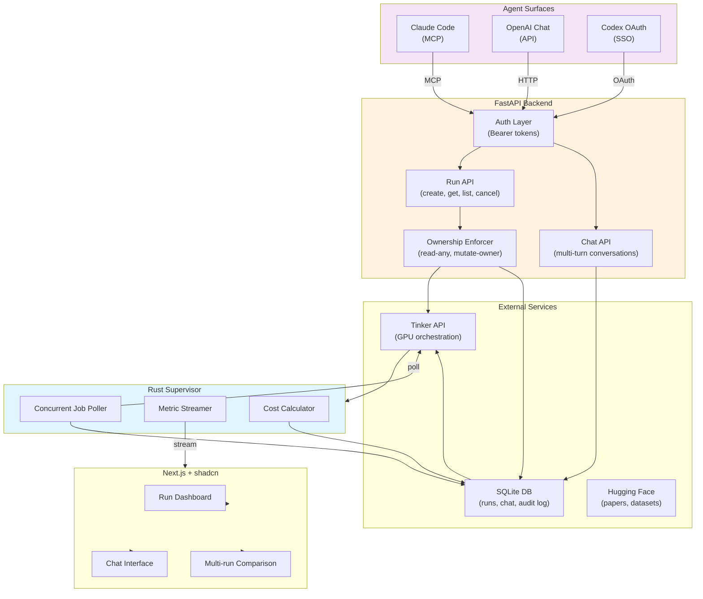

# Architecture Overview

Stellarator is a multi-layer system that bridges LLM agents with Tinker, a managed fine-tuning platform. This page explains each layer and why we made key design decisions.

## System Diagram



## Layer-by-Layer

### 1. Agent Surfaces (Auth & Ingress)

Three independent surfaces allow agents to interact with Stellarator:

- **Claude Code (MCP)**: Tools exposed via MCP socket; token-based auth
- **OpenAI Chat**: REST API endpoint; agents use OpenAI to design runs and send instructions
- **Codex OAuth**: SSO integration; agents authenticate via Codex identity

Each agent gets a bearer token. The backend identifies the agent by token and tags all operations with `agent_id`.

**Why three surfaces?**
- Claude Code is ideal for research-intensive workflows (direct access to papers + code execution)
- OpenAI Chat works for conversational planning without IDE access
- Codex OAuth integrates tightly with the Codex IDE for developers already there

### 2. FastAPI Backend (Business Logic)

The backend is the system's brain:

- **Auth Layer**: Validates bearer tokens, maps to agent IDs
- **Run API**: Create, read, list, pause, cancel runs (with ownership enforcement)
- **Chat API**: Multi-turn conversation threads per agent; delegates to agent drivers (OpenAI API, etc.)
- **Ownership Enforcer**: Ensures only the run owner can mutate; all agents can read

Each endpoint is stateless and can be scaled horizontally.

**Why FastAPI?**
- Async I/O for concurrent Tinker requests
- OpenAPI auto-docs for clear API contracts
- Lightweight enough to run alongside the Rust supervisor in one container

### 3. Tinker API (GPU Orchestration)

Tinker is the managed fine-tuning platform (external service). Stellarator:

1. Calls `POST /jobs` to launch training runs
2. Polls `GET /jobs/{id}` for status and metrics
3. Cancels/pauses via `POST /jobs/{id}/cancel` and `/jobs/{id}/pause`
4. Streams metrics via `GET /jobs/{id}/metrics/stream`

Tinker handles the hard parts: GPU provisioning, distributed training, checkpointing, failure recovery.

Stellarator adds a layer of coordination and governance on top.

### 4. SQLite Database (Persistence)

Stores:

- **Runs**: Metadata, config, ownership, status, cost
- **Chat sessions**: Conversation history per agent
- **Audit log**: Who did what, when
- **Citations**: Research references

SQLite is appropriate for Stellarator because:
- Single-machine, low-concurrency workload
- Runs table is the source of truth, not super high-throughput
- Easy to back up and inspect
- No need for distributed transactions (yet)

### 5. Rust Supervisor (Concurrent Job Monitoring)

This is the linchpin that keeps the system responsive.

**Problem:** If you have 100 concurrent training runs, polling Tinker for each one in Python would be synchronous and slow.

**Solution:** A Rust supervisor runs in a separate thread/process and:

1. **Concurrent Poller**: Polls all active Tinker jobs concurrently (tokio async runtime)
2. **Metric Streamer**: Streams live metrics (loss, eval accuracy, etc.) to the frontend via WebSocket
3. **Cost Calculator**: Computes final costs when jobs finish

**Why Rust?**
- Memory efficiency: can track 1000+ concurrent jobs without bloat
- Concurrency: tokio is battle-tested for high-fan-out polling
- Isolation: runs in separate process, so a hang doesn't block the API server

The supervisor is a single binary (`supervisor` binary in `/backend`) that connects to both Tinker and the SQLite DB.

### 6. Next.js Frontend (Dashboard)

A real-time dashboard built with Next.js + shadcn:

- **Run Dashboard** (`/runs`): List all visible runs, filter by agent/status/date
- **Chat Interface** (`/chat`): Talk to OpenAI/Codex agents from the browser
- **Multi-run Comparison** (`/runs/compare`): Side-by-side loss curves for 2-6 runs
- **Cost Breakdown**: See total spend per agent, per month

Frontend talks to:
- FastAPI backend for run CRUD
- WebSocket connection to supervisor for live metrics

---

## Data Flow: Launching a Run

```
1. Agent calls create_run()
   │
2. Backend validates auth, generates run_id, stores in DB with status="pending"
   │
3. Backend calls TinkerClient.create_job()
   │
4. Tinker provisions GPU, returns tinker_job_id
   │
5. Backend stores tinker_job_id, updates status="running"
   │
6. Supervisor polls Tinker.get_job(tinker_job_id) every 5 seconds
   │
7. Supervisor streams metrics to frontend via WebSocket
   │
8. When Tinker reports completion, supervisor:
   - Calculates cost
   - Updates run.status, run.finished_at, run.cost_usd
   - Notifies agent (optional email/Slack)
   │
9. Agent checks dashboard or polls run_id to see final cost and loss curves
```

---

## Design Principles

1. **Agents are first-class citizens** — Ownership, tokens, audit trails ensure agents can be trusted partners
2. **Read-anywhere, mutate-by-owner** — Promotes transparency and prevents accidents
3. **Citations are mandatory** — Every run should reference the papers and datasets that justified it
4. **Cost is explicit** — Every GPU-second is tracked and attributed
5. **Concurrency matters** — The Rust supervisor ensures we can handle dozens of simultaneous training runs without I/O blocking

---

## Next Steps

- See [agents.md](agents.md) for how to connect each agent surface
- See [runs.md](runs.md) for the run model and data structures
- See [cost.md](cost.md) for cost calculation details
